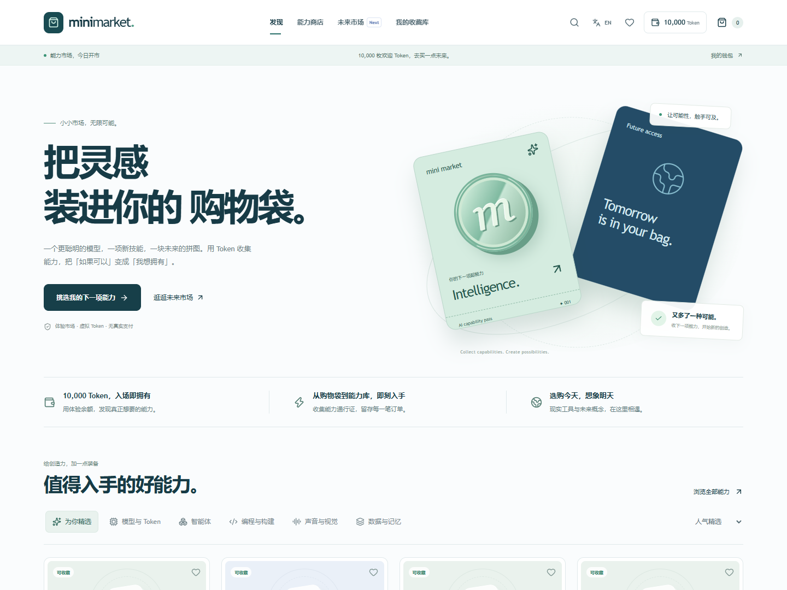

<div align="center">


# Mini Market

**A simulation-only marketplace for real AI capabilities and speculative futures.**

[Live Demo](https://styayur.github.io/mini-market/) · [Documentation](README.md#本地开发) · [Issues](https://github.com/styayur/mini-market/issues)

[](https://github.com/styayur/mini-market/actions/workflows/ci.yml)
[](LICENSE)
[]()
[]()
[]()



</div>

## 为什么做这个市场

当软件能力也能像商品一样被挑选，我们会想买什么？更聪明的模型、可以随身携带的记忆，还是一个能替自己协作的智能体？

Mini Market 用接近真实电商的浏览、购物袋、钱包、支付与收据流程，让用户体验「拥有了一种新能力」的满足感。现实工具为探索提供起点，未来概念让尚未满足的需求变成可以讨论、收藏和支持的对象。

这是一个**消费体验与未来市场原型**。Token 是免费的站内体验单位，不是加密货币，也不等于提供商的真实推理 Token；购买不会开通真实 API、订阅或资产权益。

## 这次更新

- **商店首页**：原创 CSS 能力通行证与 Token 插画、分区货架、商品筛选、价格排序、套装加购、未来概念橱窗。
- **商品体验**：直接加购、心愿单、购买状态反馈、商品详情与官方文档入口；价格统一使用体验 Token。
- **购物袋**：每种通行证支持 1–99 张，实时更新总价与钱包余额，可移除商品。
- **结算**：确认商品、数量、支付后余额及体验说明；余额不足时可就地补充免费 Token。
- **成交反馈**：独立订单号、明细收据、支付后余额、文本收据下载，以及前往收藏库的入口。
- **钱包**：初始 10,000 Token，可免费补充 1,000 / 5,000 / 10,000 Token；购买订单、充值记录、概念支持分别可查。
- **能力收藏库**：展示已收集的能力、通行证总数和最近购买日期，保留官方文档链接。
- **未来市场**：搜索、推荐排序、支持量排序、我的关注、我的概念；提供 50 / 200 / 500 Token 支持档位和自定义整数数量。
- **概念实验室**：保留本地生成与编辑流程；新增可静态部署的本地概念详情入口，支持刷新。
- **语言与设备**：主要购物流程默认中文，可切换英文并记住偏好；适配桌面与手机，支持键盘焦点、原生支持弹窗和减少动态效果偏好。

商品名称、技术说明及部分原有编辑器页面保留英文。商品数据是人工维护的目录快照；真实服务的能力、价格与可用性以提供商文档为准。未来市场的初始排序与支持量是示例数据，并非真实交易行情。

## 体验一笔订单

1. 在首页领取默认的 10,000 Token 体验余额，无需注册。
2. 点击商品卡片的 `+`，或把模型启动套装整套加入购物袋。
3. 进入购物袋，调整通行证张数，查看合计。
4. 前往结算，确认体验说明并支付 Token。
5. 保存收据，在「能力收藏库」查看通行证，在「钱包与订单」查看记录。
6. 进入未来市场，支持一个希望出现的概念，或在概念实验室发布自己的想法。

所有数据都保存在当前浏览器。你可以在设置页重置体验；清理浏览器存储也会清除收藏与订单。

## 本地开发

建议使用 **Node.js 24 LTS**（与 GitHub Actions 一致）。

```bash
git clone https://github.com/styayur/mini-market.git
cd mini-market
npm ci
npm run dev
```

访问 [localhost:3000](http://localhost:3000)。

```bash
npm test             # 结算规则测试
npx tsc --noEmit      # 类型检查
npm run lint         # ESLint
npm run build        # 静态导出到 out/
```

`output: "export"` 项目应使用静态服务器预览 `out/`；`next start` 不用于静态导出。

```bash
python -m http.server 3001 --directory out
```

### 浏览器回归测试

先启动开发服务器，另开终端：

```bash
python -m pip install playwright
python -m playwright install chromium
python tests/storefront.spec.py
python tests/commerce-browser.spec.py
```

测试默认使用已安装的 Microsoft Edge；使用 Playwright Chromium 时设置 `BROWSER_CHANNEL=chromium`。可通过 `BASE_URL` 指定待测站点，默认 `http://localhost:3000`。

PowerShell 示例：

```powershell
$env:BROWSER_CHANNEL="chromium"
$env:BASE_URL="http://localhost:3000"
python tests/storefront.spec.py
python tests/commerce-browser.spec.py
```

浏览器测试覆盖加购、数量调整、扣款、收据下载、刷新持久化、钱包补充、历史订单、概念支持、弹窗 Escape、套装加购、语言切换，以及 390px / 768px 下九个主要路由的横向溢出检查。截图与临时产物写入 `.qa/`，不提交到仓库。

本次还在带 `/mini-market` 子路径的生产静态导出上验证了余额不足与补充、连续点击支付、防重复扣款、零余额购买免费通行证、移除商品、搜索空状态和本地概念发布后刷新。

## 实现结构

```text
app/
  page.tsx                 商店首页
  storefront.css           商店、购物袋、结算、钱包、未来市场视觉系统
  globals.css              通用布局与原有详情/编辑器样式
  concepts/view/           本地发布概念的静态详情入口
components/
  product/                 商品卡片、购物袋、结算、收藏库
  dashboard/               钱包、历史订单、支持记录、设置
  concept/                 概念详情、支持弹窗、概念实验室
  marketplace/             筛选、搜索、未来市场
  providers/               语言与浏览器内市场状态
lib/
  commerce.ts              纯函数结算、数量规则
  storage.ts               本地存储与旧数据字段兼容
  links.ts                 静态兼容的概念链接
  search.ts                搜索与排序
  concept-generator.ts     本地确定性概念生成
data/                     人工维护的商品、概念、分类与提供商
tests/                    结算单元测试与浏览器回归脚本
.github/workflows/        GitHub Pages 构建与部署
```

技术栈：Next.js 16、React 19、TypeScript、Tailwind CSS 4、Lucide React；不依赖支付服务、链上钱包或外部 AI 调用。

### 数据与结算约定

- 沿用 `mini-market-demo-v1` 存储键，兼容旧购物袋；缺失数量按 1 处理。
- 新增 `cartQuantities`、`orders`、`topUps`；原有收藏、概念与交易记录保留。
- 结算统一计算数量、总额、余额、收藏和交易记录，并生成订单快照。
- 状态通过同步引用提交，阻止同一购物袋的连续支付事件重复扣款。
- 不足余额、空购物袋、未知商品及未来概念不能作为现实商品结算。
- 订单快照保存购买时名称与单价，收据不会随目录调整而变化。
- 存储被浏览器禁用时可以在当前页面会话体验，但刷新后不能恢复。
- 无服务端账户、跨设备同步、共享库存或实时行情；多个标签页没有交易锁，不适合真实交易。

主要路由：`/`、`/marketplace`、`/marketplace/[slug]`、`/cart`、`/checkout`、`/dashboard`、`/library`、`/favorites`、`/future`、`/concepts/new`、`/concepts/[slug]`、`/concepts/view?slug=...`、`/search`、`/settings`。

## GitHub Pages

推送到 `main` 会触发 `.github/workflows/deploy-pages.yml`：安装依赖 → 类型检查 → 结算测试 → ESLint → 静态构建 → 部署。

仓库设置中的 **Settings → Pages → Source** 应为 **GitHub Actions**。生产构建使用仓库子路径：

```powershell
$env:NEXT_PUBLIC_BASE_PATH="/mini-market"
npm run build
```

此时需要在 `/mini-market/` 路径下托管 `out/`，不能直接当作根路径网站预览。正式地址：[styayur.github.io/mini-market](https://styayur.github.io/mini-market/)。

## English

**Great ideas deserve a shopping bag.** Mini Market is an AI capability shopping experience with free demo Tokens: discover model and tool passes, add them to your bag, adjust quantities, check out, save a receipt, and build a personal collection.

The future market turns speculative capabilities into browsable concepts you can watch, support, or create locally. Its initial metrics are illustrative, and no concept promises delivery.

The refreshed experience includes a collectible-pass storefront, quick add, starter bundles, a Token wallet, order history, downloadable receipts, collection quantities, and concept contributions. Primary shopping flows support Chinese and English. Technical catalog content and some existing editor screens remain in English.

Run with Node.js 24 and `npm ci && npm run dev`. Validate with `npm test`, `npx tsc --noEmit`, `npm run lint`, and `npm run build`. The app exports static files to `out/` for GitHub Pages. Browser regression tests live in `tests/storefront.spec.py` and accept `BASE_URL` and `BROWSER_CHANNEL` environment variables.

This is a local prototype: no real payments, crypto assets, inference credits, provider access, server accounts, or cross-device synchronization. Wallets, orders and collections live in browser storage. Use official provider documentation for current service details.

## 参与开发与反馈 / Contributing

- **GitHub Issues**：可复现错误和范围明确的功能请求。
- **GitHub Discussions**：暂未启用；设计讨论可先使用 Discord。
- **Discord**：[加入社区](https://discord.gg/wA2xy6VPK)，用于快速交流、早期反馈和项目讨论；它不是 SLA 支持渠道。
- **Security**：安全问题请按 [SECURITY.md](SECURITY.md) 私下报告，不要开公开 Issue。
- **Contributing**：开发环境、simulation-only 边界和提交检查见 [CONTRIBUTING.md](CONTRIBUTING.md)。

Token、钱包、订单、收据和购买流程均为体验模拟，不代表真实支付、加密货币、API 额度或资产权益。

## 许可证 / License

[GNU General Public License v3.0](LICENSE).
